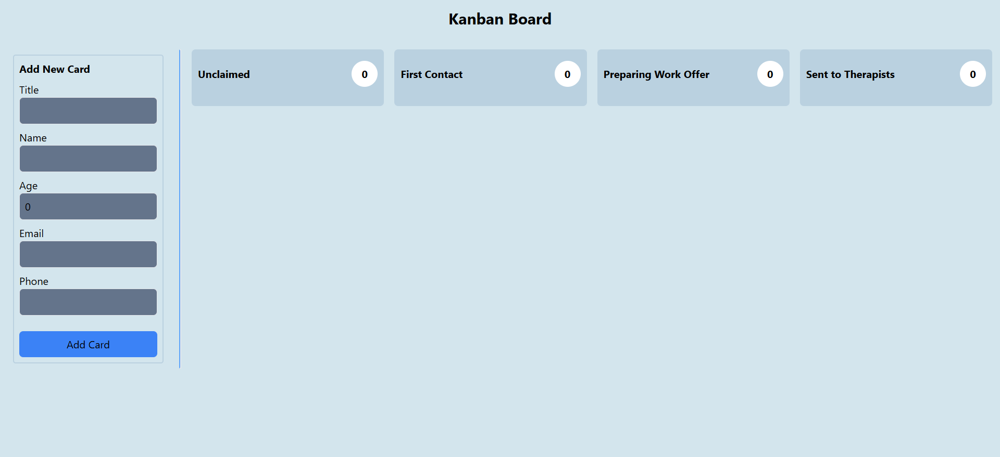
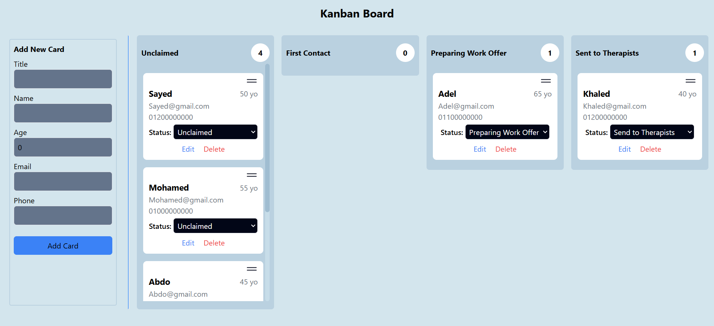

<h1 align="center">
   Kanban Board Bookings
</h1>

<div align="center" id="top">


</div>
<div align="center">
  <br>
  <a href="https://kanbanboard-silk.vercel.app/" >
  
  </a>
  <br>
  <br>
</div>

---

<details>
  <summary>Table of Contents</summary>
  <ol>
    <li>
      <a href="#about-the-project">About The Project</a>
      <ul>
        <li><a href="#features">Key Features</a></li>
        <li><a href="#built-with">Built With</a></li>
      </ul>
    </li>
    <li>
      <a href="#getting-started">Getting Started</a>
      <ul>
        <li><a href="#installation">Installation</a></li>
      </ul>
    </li>
  </ol>
</details>

---

## About The Project

**Kanban Board Bookings** is an intuitive task management board designed to
streamline operations for an online mental health clinic. It features a
user-friendly interface for tracking new member bookings, validating member
information, and seamlessly managing tasks across four stages of processing.

<div align="center">
  
</div>

### Features

-   **Member Form Validations**:
    -   Ensure correct data entry for fields like Name, Title, Age, Email, and
        Mobile Number with error handling.
-   **CRUD Operations**:

    -   Add, view, update, and delete member cards.

-   **Card Status Management**:

    -   Move cards between columns to reflect their current status.

-   **Drag-and-Drop Functionality**:

    -   Intuitive movement of cards across columns using drag-and-drop.

-   **Persistent Data with Local Storage**:

    -   Save and reload data for a consistent user experience.

-   **Dynamic Card Count**:

    -   Automatically display and update the count of cards in each column.

-   **Tailwind CSS Styling**:
    -   Aesthetic and responsive design for all components.

<p align="right">(<a href="#top">back to top</a>)</p>

---

## Built With

-   **React**
-   **TypeScript**
-   **Tailwind CSS**
-   **React Hook Form**
-   **Yup**
-   **React DnD**

<p align="right">(<a href="#top">back to top</a>)</p>

---

## Getting Started

To set up and run this project locally, follow the steps below:

### Installation

1.  **Clone the repository**:

    ```bash
    git clone https://github.com/SayedShehata1/Kanban-Board

    ```

2.  go to the project folder

    ```sh
    cd Kanban-Board

    ```

3.  install dependencies

    ```bash
    npm install
    ```

4.  Run development server

        ```sh
        npm run dev
        ```

        <p align="right">(<a href="#top">back to top</a>)</p>
